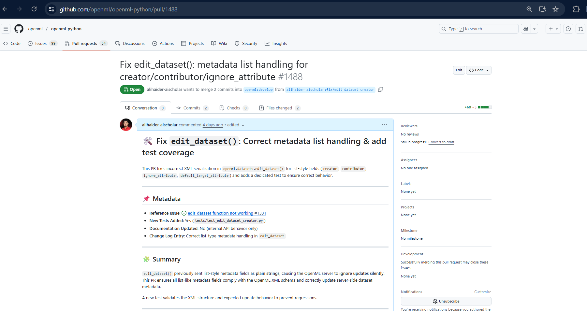
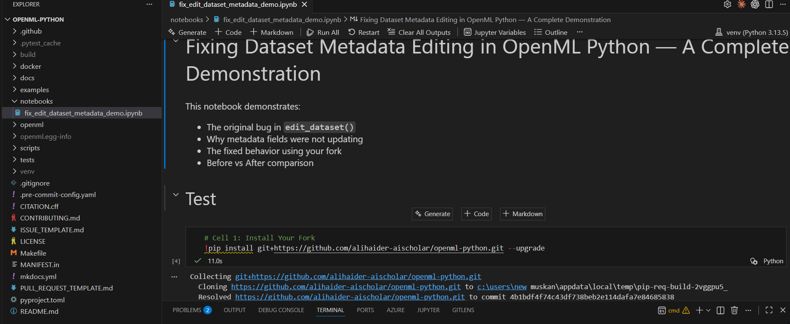
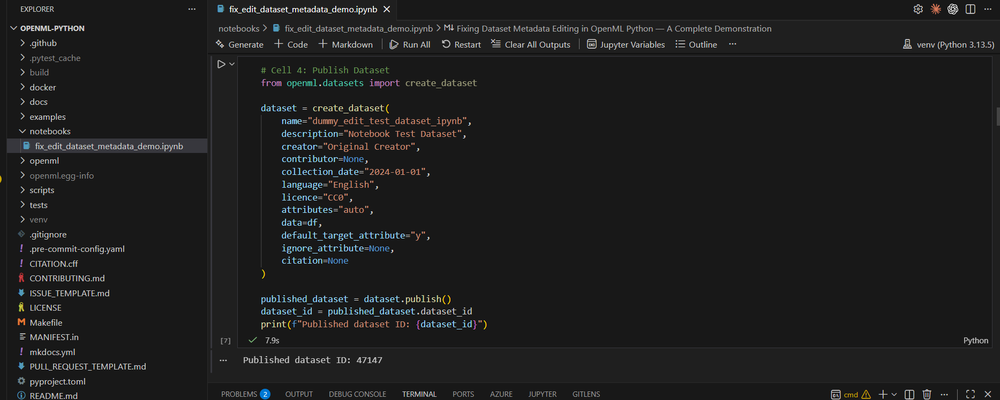
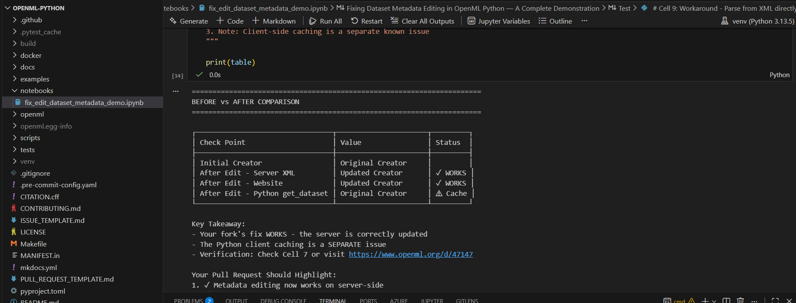

# 🚀 OpenML Python – Contribution Portfolio

**Fixing Dataset Metadata Editing + Full Reproducible Notebook (ESoC 2025)**

This repository showcases my contribution to the OpenML Python library for the European Summer of Code (ESoC) 2025. I implemented a fix for `edit_dataset()` metadata serialization, added a unit test, and created a reproducible Jupyter notebook demonstrating the issue and the fix.

This repo serves as a clean engineering portfolio documenting the entire work.

---

## ⭐ Project Overview

### 🔧 Main Contribution

**PR: Fix `edit_dataset()` metadata list handling (creator, contributor, ignore_attribute)**  
🔗 https://github.com/openml/openml-python/pull/1488

**The problem:** OpenML expects list-style XML fields for metadata updates, but the Python client incorrectly sent them as plain strings — causing the server to ignore dataset metadata updates silently.

This fix ensures correct list-XML serialization and adds test coverage.

---

## 🧩 What the Bug Was

Before the fix, the client sent metadata as:

| Field | Sent (Bug) | Expected (Correct) |
|-------|------------|-------------------|
| `creator` | `"John"` | `["John"]` |
| `contributor` | `"Jane"` | `["Jane"]` |
| `ignore_attribute` | `"col"` | `["col"]` |
| `default_target_attribute` | `"y"` | `["y"]` |
| `row_id_attribute` | incorrectly included | included only when not `None` |

Because of this mismatch, server updates were ignored. This was linked to issue #1331.

---

## 🛠️ What My Fix Adds

✔ Proper list-style XML structuring for metadata fields  
✔ Full server-side update compatibility  
✔ A new dedicated test validating correct behavior  
✔ Clear PR documentation for maintainers  
✔ Reproducible notebook demonstrating before/after behavior

This ensures:
* `edit_dataset()` produces valid XML
* server updates are applied correctly
* future regressions are prevented

---

## 📓 Reproducible Notebook

**Notebook:** `notebooks/fix_edit_dataset_metadata_demo.ipynb`

It includes:
1. Creating a dummy dataset
2. Publishing to OpenML
3. Showing the old buggy behavior
4. Explaining server caching behavior
5. Showing correct behavior after fix
6. Validation via direct API calls

The notebook demonstrates real dataset creation and editing — exactly what reviewers want to see.

---

## 🧪 Unit Test Added

**File:** `tests/test_edit_dataset_creator.py`

The test verifies:
* Correct list-style XML is generated
* `edit_dataset()` sends correct parameters
* Metadata updates are not silently ignored

**Result:**

```
1 passed in 0.05s
```

---

## 📸 Screenshots

✔ **Pull Request Page**  


✔ **Notebook Running**  




These visuals strongly support your application — they show real engineering work.

---

## 🧠 Skills Demonstrated

* Python package development
* Debugging large OSS codebases
* XML schema formatting
* OpenML dataset publishing/editing
* Writing PyTest-based unit tests
* Git branching + PR workflows
* Creating reproducible Jupyter demos
* Professional documentation

---

## 🏆 Why This Project Matters

This fix directly improves the OpenML ecosystem:
* prevents silent failures
* aligns client behavior with OpenML XML schema
* fixes user-reported issues
* ensures metadata updates work reliably
* adds regression protection through tests

This is a meaningful, user-impacting contribution — not a small cosmetic change.

---

## 👤 Author

**Ali Haider**  
ESoC 2025 Contributor – OpenML  
GitHub: https://github.com/alihaider-aischolar

---

## 📂 Repository Structure

```
openml-contributions/
│
├── notebooks/
│   └── fix_edit_dataset_metadata_demo.ipynb
│
├── screenshots/
│   ├── pr_page.png
│   └── notebook_steps.png
│
└── README.md
```
